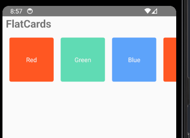

This is a new [**React Native**](https://reactnative.dev) project, bootstrapped using [`@react-native-community/cli`](https://github.com/react-native-community/cli).

# Getting Started

> **Note**: Make sure you have completed the [React Native - Environment Setup](https://reactnative.dev/docs/environment-setup) instructions till "Creating a new application" step, before proceeding.

## Step 1: Start the Metro Server

First, you will need to start **Metro**, the JavaScript _bundler_ that ships _with_ React Native.

To start Metro, run the following command from the _root_ of your React Native project:

```bash
# using npm
npm start

# OR using Yarn
yarn start
```

## Step 2: Start your Application

Let Metro Bundler run in its _own_ terminal. Open a _new_ terminal from the _root_ of your React Native project. Run the following command to start your _Android_ or _iOS_ app:

### For Android

```bash
# using npm
npm run android

# OR using Yarn
yarn android
```

### For iOS

```bash
# using npm
npm run ios

# OR using Yarn
yarn ios
```

## note

everthing in react native is wrapped inside a view

## css flex

```
 container: {
    flex: 1,
    flexDirection: 'row',
    padding: 8,
  },
  card: {
    flex: 1,

    justifyContent: 'center',
    alignItems: 'center',
    width: 100,
    height: 100,
    borderRadius: 4,
    margin: 8,
  },
```



## ScrollView

A ScrollView is a view that contains multiple child views, and allows the user to scroll through the views. This is useful when your views don't fit within the boundaries of the screen.

Some key things to note about ScrollView:

It renders all its child views at once, so performance can be an issue with a large number of child views.

For long lists of items, use FlatList instead of ScrollView. FlatList renders items lazily as the user scrolls.

ScrollView works best for a small number of child views that have a limited size.

It supports both vertical and horizontal scrolling by setting the horizontal prop.

You can enable paging through child views using the pagingEnabled prop.

```
 <ScrollView>
    {/* child views */}
  </ScrollView>


```

can pass props also like this

```
   <ScrollView
    contentContainerStyle={styles.contentContainer}
    showsVerticalScrollIndicator
    scrollEventThrottle={16}
  >
  </ScrollView>
```

### Some important props are:

contentContainerStyle: Styles applied to the scroll view content container.

showsVerticalScrollIndicator: Shows a vertical scroll indicator.

scrollEventThrottle: Controls how often the scroll event is fired.
